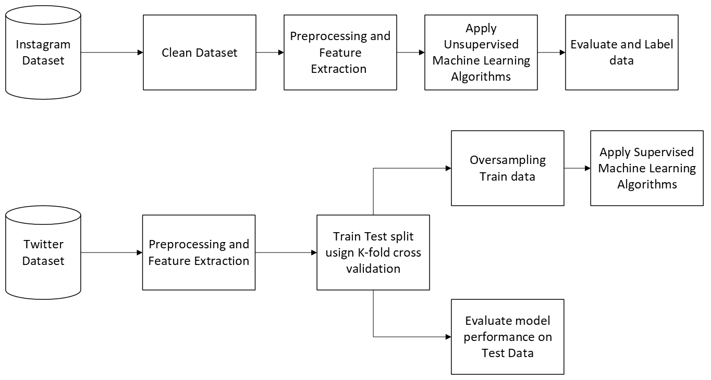

# Hate Speech Detection in Online Social Networks

## Introduction
This project aims to detect hate speech on social media platforms like Twitter and Instagram. By leveraging machine learning and deep learning models, the project seeks to create a robust system capable of identifying hate speech in various contexts.

## Architecture

## Dataset
### Twitter Dataset
The Twitter dataset used for supervised classification consists of tweets labelled as hate speech or not and 9 different categories that the text labelled as hate belonged to. It includes 3 attributes Tweet, label and category. The dataset was collected from HuggingFace.

### Instagram Dataset
Data for analysis of Instagram comments was collected through web-scraping using Selenium. 15 posts that belonged to pages of celebrities, new channels, cancelled influencers, political figures and public accounts that were criticized for various reasons were considered.

## Algorithms Used

### Supervised Learning:
- Logistic Regression
- Support Vector Machine (SVM)
- Random Forest
- Gradient Boosting
- Decision Tree
- CATBoost
- Naive Bayes

### Unsupervised Learning:
- K-Means Clustering
- Gaussian Mixture

## Results

