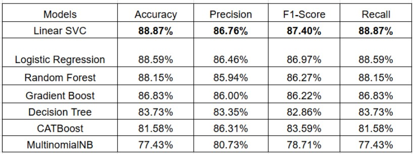
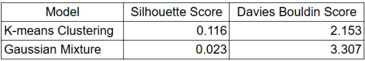

# Hate Speech Detection in Online Social Networks

## Introduction
This project aims to detect hate speech on social media platforms like Twitter and Instagram. By leveraging machine learning and deep learning models, the project seeks to create a robust system capable of identifying hate speech in various contexts.

## Architecture

## Dataset
### Twitter Dataset
The Twitter dataset used for supervised classification consists of tweets labelled as hate speech or not and 9 different categories that the text labelled as hate belonged to. It includes 3 attributes Tweet, label and category. The dataset was collected from HuggingFace.

### Instagram Dataset
Data for analysis of Instagram comments was collected through web-scraping using Selenium. 15 posts that belonged to pages of celebrities, new channels, cancelled influencers, political figures and public accounts that were criticized for various reasons were considered.

## Algorithms Used

### Supervised Learning:
- Logistic Regression
- Support Vector Machine (SVM)
- Random Forest
- Gradient Boosting
- Decision Tree
- CATBoost
- Naive Bayes

### Unsupervised Learning:
- K-Means Clustering
- Gaussian Mixture

## Results
### Twitter Result

### Instagram Result

## Scope for future work
The subsequent work would focus on addressing the overlapping of clusters in Instagram data and explore refined and advanced clustering techniques to distinguish between the hate , non-hate and different types of hate speech distinctly. Furthermore, the performance of the devised model for Twitter data could be evaluated on real time twitter data to analyse its effectiveness and the model could be improved accordingly.
